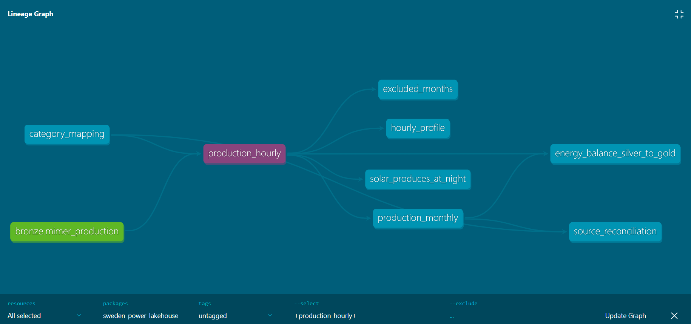

# sweden-power-lakehouse

Two Swedish public agencies publish electricity production per bidding
zone. Svenska kraftnät (the transmission system operator) measures hour by
hour in kWh; Statistics Sweden (SCB) publishes monthly statistics in GWh.
They describe the same physical reality.

This project puts them against each other in a medallion pipeline on
Databricks and answers one question: **do they agree, and where they do
not, why?**

All data is public. No login, no personal data, everything can be
reproduced from the source.

---

## The result

50 months, January 2021 to February 2025, six production types and four
bidding zones.

| Production type | Median deviation | Direction | Within SCB's rounding |
|---|---|---|---|
| Hydro | 0.07–0.19 % | Mimer slightly higher | 15–44 of 50 months |
| Wind | 0.09–0.17 % | Mimer slightly higher | 15–22 of 50 |
| Nuclear | 0.09 % | mixed | 13 of 50 |
| Solar | 39–52 % | **Mimer lower** | 0–26 of 50 |
| Thermal | 37–81 % | **Mimer lower** | 0 of 50 |

Three production types agree to within a tenth of a percent. Two do not,
and they deviate in the same direction in every bidding zone and every
month. That is not noise.

### Solar and thermal: a difference in definition, not an error

SCB's own documentation answers the solar case. Grid-connected solar
includes, for SCB, *estimated self-consumed production by the plant
owner*. Svenska kraftnät settles only what is actually fed into the grid.
Electricity produced on a rooftop and consumed in the same house exists in
one source but not the other, and the difference is roughly half of SCB's
figure.

Thermal shows the same pattern but larger. The most likely explanation is
the same one — industrial combined heat and power consumed on site is not
part of balance settlement — but I have not confirmed it in the sources'
documentation, and so I do not claim it.

**Neither source is wrong.** They answer different questions. Ask "how
much electricity is produced" and SCB is right. Ask "how much reaches the
grid" and Svenska kraftnät is right. Comparing them without knowing this
yields a number that looks like an error but is not one.

### August 2024: same month, two points in time

Nuclear in SE3 sits at a 0.09 % median deviation. One month stands out:
August 2024, where Svenska kraftnät is 322 GWh lower, or 7.5 %.

The publication timestamp explains it. Every month of 2024 was finalised
the day after the month ended. August is the only one whose last
publication came on 5 September, four days later than all the others.
Svenska kraftnät went back and corrected the month. SCB's figure in the
downloaded file is preliminary and fixed at an earlier point in time.

Two correct sources, the same month, different answers, because they are
fixed at different vintages. This is only visible because the publication
timestamp was preserved all the way from bronze.

---

## Why medallion

**Bronze** is a faithful copy. Everything as text, nothing removed,
nothing reinterpreted. Each file is registered with URL, timestamp, size
and SHA-256 in a manifest. If something goes wrong in silver it can be
rebuilt without contacting the source again, and it is possible to prove
which version of the data was used.

**Silver** is where the decisions are made, and where they can be
reviewed. Wide to long, ISO-8859-1 to UTF-8, kWh and GWh to MWh, SN codes
to SE codes, decimal comma to point, categories to a shared vocabulary.
Every decision is a piece of code that can be read and challenged.

**Gold** is aggregates someone actually wants: monthly production, the
comparison between sources, and a daily profile per production type.

The dataset is small enough that Pandas would have sufficed. The point of
the layers is not performance but that every transformation has a place
where it belongs, and that the question "where did this number come from"
has an answer.

---

## Differences between the sources

Full list in [`docs/source-differences.md`](docs/source-differences.md),
written before any code. In short:

| | Svenska kraftnät (Mimer) | SCB (table TAB78) |
|---|---|---|
| Resolution | hour | calendar month |
| Unit | kWh | GWh, integers |
| Shape | one row per hour | one column per month |
| Zone code | SN1–SN4 | SE1–SE4 |
| Encoding | UTF-8 with BOM | ISO-8859-1 |
| Delimiter | semicolon | comma |
| Decimal mark | comma | point |
| Status | settled, with publication timestamp | preliminary, revised |

The SCB file is formatted to be read by a human in Excel: a title row, a
blank row, wide format, trailing spaces on the category names and double
spaces inside them. Four of the six failures during the build came from
that one file. The Mimer files loaded straight in.

### Zero means two different things

SCB writes 0 for nuclear in SE1, SE2 and SE4. There are no nuclear plants
there, so it is not a measured zero but "this category does not apply".
Mimer responds with an empty file for the same combinations.

Silver uses Mimer's manifest as the authority and marks those rows
`not_applicable` rather than leaving them as zeros among measured values.
Writing both as 0 makes every average across bidding zones wrong.

---

## The dbt layer

Silver and gold exist twice: once as PySpark notebooks, once as dbt models.
They produce identical tables, and that is the point — the notebooks came
first, and dbt was added on top to see what the switch actually buys.

What it buys:

- **No manual ordering.** `source_reconciliation` reads
  `ref('production_monthly')`, which reads `ref('production_hourly')`,
  which reads `ref('category_mapping')`. dbt derives the dependency graph
  from those references and runs the models in order. Nothing tells it
  that the seed comes first.
- **Tests as their own files.** The quality gates below are `assert`
  statements inside a notebook in the PySpark version. In dbt they are
  declarations in YAML, plus two SQL files that return the rows which must
  not exist. A reviewer can read them without reading the pipeline.
- **The mapping is data, not code.** `seeds/category_mapping.csv` replaces
  a Python list. It can be changed in a pull request by someone who does
  not write Spark.
- **Generated documentation.** `dbt docs generate` builds a lineage graph
  from bronze through every model to every test.



Read left to right: the source in green, the mapping seed beside it, then
`production_hourly` and everything built from it. Both hand-written tests
appear as nodes, and `energy_balance_silver_to_gold` depends on silver and
gold at once, which is exactly what a balance check should do.

### What stays in PySpark

Parsing the SCB file. It is wide, with a title row, a blank row and a
number of month columns that grows every time the table is updated.
Unpivoting that in SQL would need introspection at compile time. Spark
does it in a few lines, and dbt takes over once the data is rectangular —
the notebook's output is declared as a source in `models/sources.yml`.

dbt transforms structured data. It does not parse semi-structured text,
and it does not ingest. Using it for either would be using it wrong.

### Running it

```bash
cd dbt
$env:DATABRICKS_TOKEN = "..."   # never stored in a file
dbt deps  --profiles-dir .
dbt build --profiles-dir .      # seed, models and tests in dependency order
```

`profiles.yml` reads the token from the environment, so the file itself
carries no secret and is checked in.

---

## Quality gates

The job fails loudly rather than delivering quietly wrong data. Every
check below exists in both implementations: as an `assert` in the PySpark
notebooks, and as a dbt test (29 of them, run by `dbt build`).

| Check | What it catches |
|---|---|
| Row count against manifest | that bronze holds exactly what was fetched |
| Unparsed rows | timestamps and numbers that failed to convert |
| Unknown categories | a category that would silently drop out of the join |
| Uniqueness | duplicates per source, zone, type and hour |
| Hours per day | incomplete days, and the time zone question |
| Negative values | except hydro, where pumped storage can go negative |
| Incomplete months | months that would otherwise sum too low unnoticed |
| Energy balance silver to gold | that aggregation loses nothing |
| **Solar at night** | the wrong production type under the right name |

The last one matters most, and it is the only one grounded in how reality
works rather than in data types. The production type exists only in
Mimer's URL parameter, not in the file. A wrong code produces no error
message but **the right name on the wrong data**, which passes every
formal check. Solar output at three in the morning must be zero. If it is
not, something mapped incorrectly.

Two checks had to be rewritten during the build:

- The encoding check looked for replacement characters. ISO-8859-1 can
  decode any byte sequence without complaining and therefore never
  produces one, so the check could never fail. It now looks for a word
  that must exist in the file.
- The solar night check used an absolute threshold and flagged 1,083
  hours of one to two MWh — settled data carries small corrections that
  are real but negligible. The test is now relative: night output is
  compared to midday output in the same zone. A wrong mapping would put
  the two on the same order of magnitude; a correct one leaves night as a
  rounding error.

A quality check that cannot fail is not a quality check.

---

## Time zone

Mimer states periods as `2024-01-01 00:00` without a time zone. If that is
Swedish local time, the DST day in March has 23 hours and the one in
October has 25. An annual total reveals nothing, since the two cancel out.

The hours-per-day check returns 24 for every day, including the DST days.
The timestamps are therefore not local time with daylight saving. Without
that check, a monthly sum would be off by one hour twice a year.

---

## Running it

```bash
# 1. Fetch raw data from Mimer (standard library only)
python ingest/download_mimer.py

# 2. Download SCB table TAB78 manually into data/raw/scb/
```

Then upload the files to the volume `workspace.bronze.landing` in
Databricks Free Edition and run the notebooks in order:

| Notebook | What it does |
|---|---|
| `notebooks/01_bronze.py` | raw data into Delta, unchanged |
| `notebooks/02_silver.py` | normalisation and quality gates |
| `notebooks/03_gold.py` | aggregates and source reconciliation |

Bronze must run first — it loads the files and parses the SCB text. Silver
and gold can then be built either by the notebooks or by `dbt build`; both
produce the same tables.

Everything runs on Databricks Free Edition at no cost.

---

## What I would do differently in production

- **Incremental loading.** The pipeline rewrites everything on each run.
  Reasonable for four years of history that does not change, wrong for a
  source updated daily. The right approach is a merge on key with the
  publication timestamp as the version field.
- **Orchestration.** dbt resolves ordering within the transformation layer,
  but nothing schedules the chain from download through bronze to `dbt
  build`. Databricks Jobs can run it; retry on failure and alerting belong
  in Airflow or Lakeflow.
- **Test coverage.** The quality gates run against real data. There are no
  unit tests on the transformations themselves, with synthetic cases for
  decimal comma, daylight saving and empty source responses.
- **History.** SCB revises its figures, but only the latest download is
  kept per dated folder. A real solution keeps every vintage and can
  answer "what did SCB say about March 2023, in March 2023".
- **eSett.** Mimer stops publishing on 2025-03-17; after that the data
  lives with eSett. Adding that source is the next step, and it is a test
  of whether the layers really are loosely coupled.

---

## Stack

Databricks Free Edition (serverless), PySpark, Delta Lake, Unity Catalog,
dbt (dbt-databricks, dbt_utils), Python.

Swedish source terms are kept in the original throughout — *elområde*
(bidding zone), *Mimer*, *avräknad* (settled) — so that they can be looked
up in the sources.

## Sources

- Svenska kraftnät, Mimer: <https://mimer.svk.se/ProductionConsumption/ProductionIndex>
- SCB, table TAB78, electricity production and use by bidding zone:
  <https://www.statistikdatabasen.scb.se/pxweb/sv/ssd/START__EN__EN0108__EN0108A/ElEO/>
- API: `https://api.scb.se/OV0104/v1/doris/sv/ssd/START/EN/EN0108/EN0108A/ElEO`
